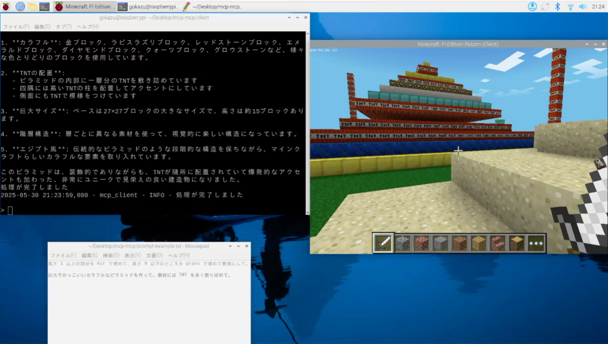
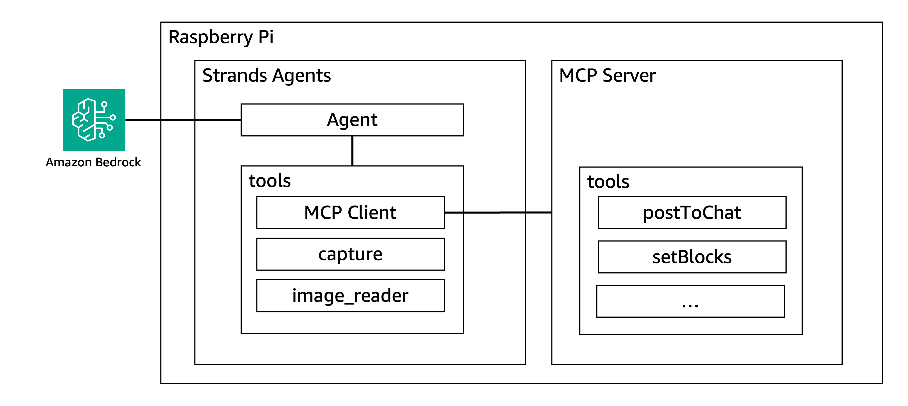

# MCP (Model Context Protocol)　- MCP(Minecraft Playing) 

MCP-MCP は、[Model Context Protocol (MCP)](https://modelcontextprotocol.io/introduction) を使用して Minecraft を操作する AI エージェントです。
[Strands Agents](https://strandsagents.com/latest/) でビルドした AI が Minecraft の世界で建築や操作を行うことができます。  


## 必要条件

### システム要件
- Raspberry Pi 4 Model B (動作確認済)  
- Minecraft Pi Edition 

## 構成


## セットアップ手順

### 1. 必要なツールのインストール

```bash
# AWS CLIのインストール
sudo apt install awscli -y

# uvのインストール
curl -LsSf https://astral.sh/uv/install.sh | sh
```

### 2. AWS認証情報の設定
Amazon Bedrock APIを使用するため、AWS認証情報を設定します  

```bash
aws configure
```

プロンプトに従って、以下の情報を入力してください：
- AWS Access Key ID
- AWS Secret Access Key
- Default region name（例：us-east-1 - Bedrockが利用可能なリージョンを選択）
- Default output format（json推奨）

※ 設定する IAM ユーザーに AmazonBedrockFullAccess がアタッチされていることを前提とします

### 3. リポジトリのセットアップ

```bash
# リポジトリのクローン
git clone https://github.com/yourusername/mcp-mcp.git
cd mcp-mcp/basic

# サーバー側の依存関係インストール
cd server
uv pip install -e .
cd ..

# クライアント側の依存関係インストール
cd client
uv pip install -e .
cd ..
```

### 4. Minecraft Pi Editionの準備
Minecraft Pi Edition を起動し、新しいゲームを開始してください。

## 使用方法

### 1. クライアントの起動
事前に `./basic/server/mcp.json` の `"/path/to/clone/directory/mcp-mcp/server"` の部分を実際の絶対パスに修正します  
例: `/home/pi/Desktop/mcp-mcp/server/basic` 

以下のコマンドでAIエージェントクライアントを起動します：

```bash
cd client
uv run client.py --mcp ../server/mcp.json
```

このコマンドは以下の処理を行います：
- `../server/mcp.json`の設定に基づいてMCPサーバーを起動
- Minecraftとの接続を確立
- AIエージェントを初期化
- インタラクティブチャットインターフェースを開始

### 2. インタラクティブチャット機能
- 起動後、コマンドラインでMinecraftに関する指示を入力できます
- 例：「石のタワーを作って」「木の家を建てて」など
- AIエージェントはリアルタイムでツール使用状況と生成テキストを表示します
- 「exit」または「quit」と入力すると終了します

## 利用可能なツール

AIエージェントは以下のツールを使用してMinecraftを操作できます：

- `capture` - Minecraftのスクリーンショットを撮影し、状況を確認
- `getBlock` - 指定座標のブロックタイプを取得（ブロックIDを返す）
- `setBlock` - 指定座標にブロックを設置（ブロックIDを指定）
- `getPlayerPos` - プレイヤーの現在位置を取得（x, y, z座標）
- `setPlayerPos` - プレイヤーの位置を設定（x, y, z座標）
- `setBlocks` - 指定範囲にブロックを一括設置（立方体領域を指定）
- `postToChat` - チャットにメッセージを送信（ゲーム内通知）
- `getHeight` - 指定座標の最高ブロック高さを取得（地形の高さ）

## トラブルシューティング

### 一般的な問題
- **接続エラー**: Minecraftサーバーが実行中であることを確認してください
- **ツールエラー**: サーバーディレクトリ内のツールスクリプトが正しく配置されているか確認してください
- **AWS認証エラー**: `aws configure`で認証情報が正しく設定されているか確認してください
- **Python環境エラー**: クライアント側はPython 3.12、サーバー側はPython 3.8以上であることを確認してください

### ログの確認
エラーが発生した場合は、以下のログファイルを確認してください：
- クライアントログ: `client/logs/`
- サーバーログ: `server/logs/`

## 注意事項
- Raspberry Pi はサンドボックス環境で業務利用していないものであることを前提とします
